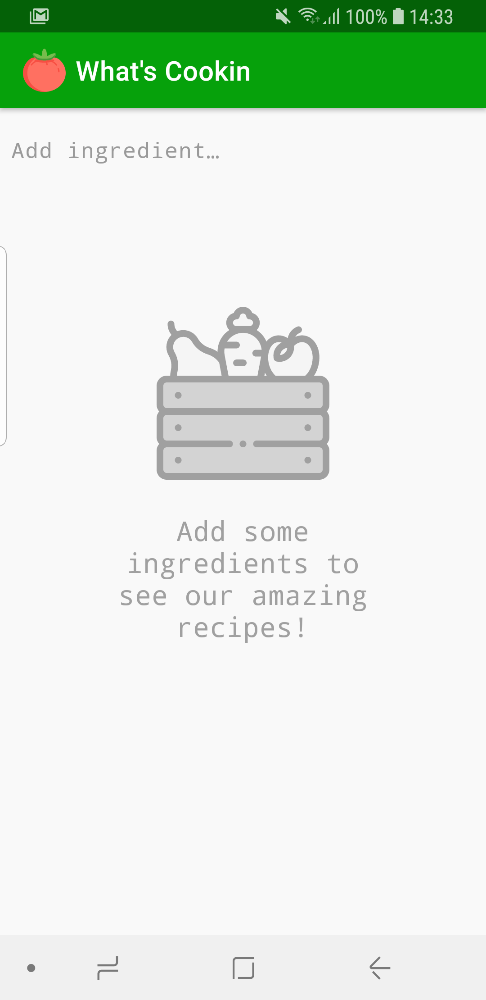
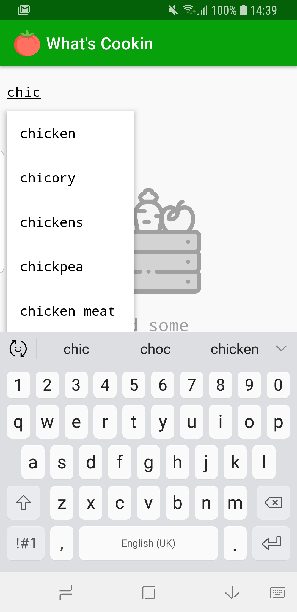
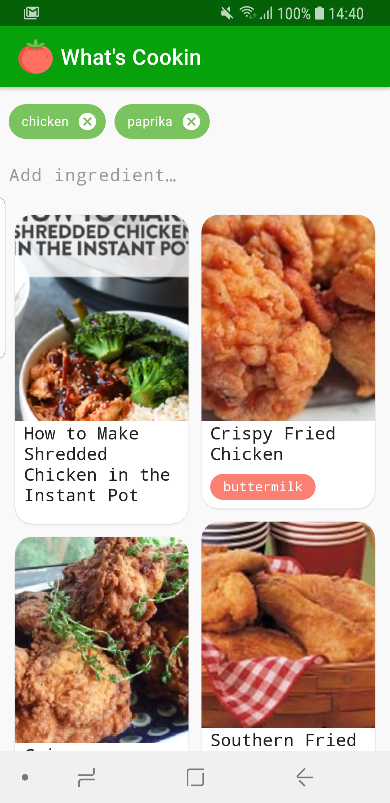
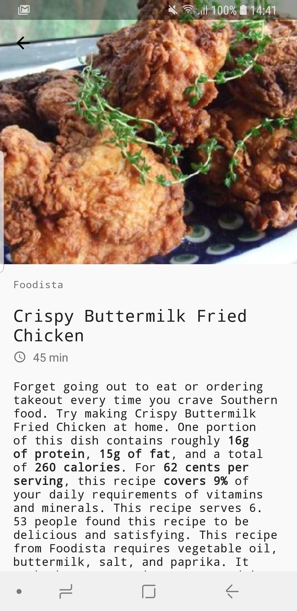

# Whats's Cooking

This is just a showcase app using [spoonacular.com](https://spoonacular.com/food-api).
The app has just two screens, one screen with the list of recipes by ingredient and a second screen with detailed view of the recipe.
There is also an autocomplete functionality for adding ingredients.

## Screens
 
**Recipe search** 

 
 
**Recipe details** 

## Tech-stack
This project is written in kotlin and takes advantage of many popular
libraries and tools of the Android ecosystem.
Some of the libraries used:
* [arrow](https://github.com/arrow-kt/arrow)
* [coil](https://github.com/coil-kt/coil)
* [squareup.moshi](https://github.com/square/moshi)
* [google.dagger](https://github.com/google/dagger)
* [coroutines](https://kotlinlang.org/docs/reference/coroutines-overview.html)
* [mockito](https://site.mockito.org/)
* [androidx.espresso](https://developer.android.com/training/testing/espresso/setup)
* [robolectric](http://robolectric.org/)

